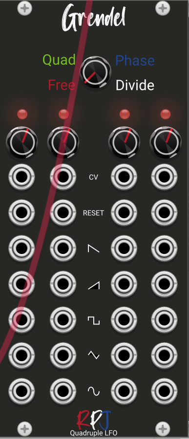

# Grendel / Quadruple LFO 

Grendel is highly inspired by the [Batumi from XAOC](http://xaocdevices.com/main/batumi/). It is a fully voltage controlled, quadruple digital LFO module with a couple of nice features. Each oscillator can be used independently or in one of the 3 other modes: quad, phase and divide. For each oscillator, there are sine, square, saw, ramp and triangle waveform outputs available. Voltage control is possible for each oscillator’s frequency, phase and reset.

The four modes of Grendel can be selected by using the selector on the top. The colors of the 4 flashing leds will also indicate the selected mode, being red for FREE, green for QUAD, blue for PHASE and white for DIVIDE.

### FREE LFO MODE

When the FREE mode is selected, all the four LFO's will operate independently. By rotating the knob for each of the LFO's, you can control the frequency. 

### QUADRATURE LFO MODE

In this mode, the first LFO is the master controlling the frequency of the 3 other remaining LFO's. Each LFO generates a wave that is shifted 90 degrees in relation to the previous one. The knobs and the CV inputs control the amplitude of the signal for each of the 3 lfo's. The knob and the cv of the first LFO control the frequency. 

### PHASE LFO MODE

The phase mode is similar to the quad mode except that you can control the amount of phase shift. This can be controlled using the knob for each LFO. Also the CV input can be used to control the phase shift.

### DIVIDE LFO MODE

In this mode the LFO's 2-4 are synced to LFO 1 with their frequencies occuring at divisions of the master. The knobs of the LFO's 2-4 define the ratio. This way frequencies 32 times slower than the master can be achieved. Again the CV input can be used to control and change the ratio.

### RESET INPUT SIGNAL

Each of the LFO's has a RESET input signal that can receive an incoming trigger impulse that resets the individual LFO to zero state (hard sync). 